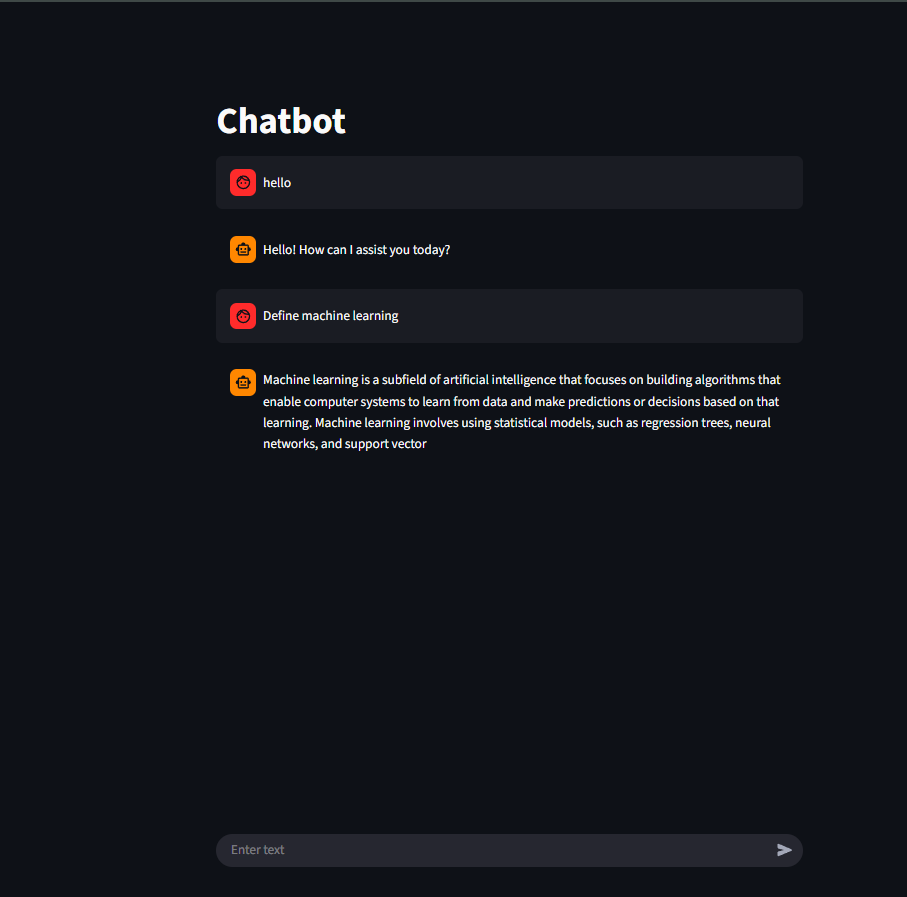

# Chatbot App: Flask and Hugging face model

This is AI chatbot built using Flask, Hugging Face’s Qwen/Qwen1.5-0.5B-Chat model, and Streamlit. 
The app also maintains chat history, and provides responses based on user input.

## Features

1. Session based chat
2. Contextual replies
3. Clear session: Users can clear chat history anytime.
4. Streamlit UI: For interactive chat interface

## API Endpoints
POST /chat: Sends a message and receives a chatbot reply

POST /clear: to clear the chat history

## Technologies Used:
Python
Flask
Hugging face: Qwen/Qwen1.5-0.5B-Chat
Streamlit

